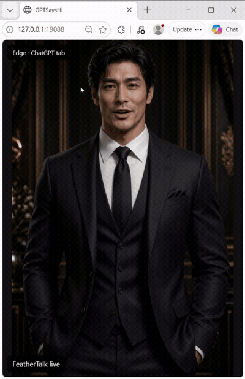

# GPTSaysHi

A Windows spin-off of SpecterSaysHi that captures audio from ChatGPT Live, ChatGPT Classic, Edge, or Chrome to drive a digital avatar. Optimized for ultra-low first-frame latency and natural lip sync. SpecterSaysHi的衍生项目，在Windows系统上把chatgpt live输出的声音直接接入程序驱动数字人嘴巴动。监听Chatgpt/Chatgpt classic/浏览器（当前支持Edge/Chrome）；工作量体现在极致压缩首帧输出延迟和调教视频令其natural上。

## Demo

[](https://github.com/YeChen-coder/GPTSaysHi/releases/download/v0.1.0/gptsayshi-edge-live-demo.mp4)

ChatGPT Live audio from an Edge tab drives the avatar in real time.
Click the animated preview to open the full **82-second recording with audio**.
The preview shows an 8-second excerpt and has no sound.

[Watch or download the full demo](https://github.com/YeChen-coder/GPTSaysHi/releases/download/v0.1.0/gptsayshi-edge-live-demo.mp4).

## What runs locally


GPTSaysHi connects the playback audio from a normal ChatGPT Live conversation
to a FeatherTalk avatar. Use the ChatGPT desktop app, ChatGPT Classic, or one
selected ChatGPT tab in Edge or Chrome. The newest connection replaces the
previous source; the previous source stops instead of reconnecting to take over.

This is a standalone project. No SpecterSaysHi checkout, prebuilt Specter image,
OpenAI API key, or API session is required. ChatGPT still handles the conversation,
account and voice allowance. GPTSaysHi does not start the Live call for you.

The default avatar uses the October 4, 2026 retrained checkpoint and candidate 1
with a 20-second forward/reverse idle loop: 500 frames at 25 fps. Speech audio
always advances forward. The renderer includes the matched teeth and chin assets
and a 400 ms transition back to idle.

## Requirements

- Windows 11 with the normal ChatGPT app or a current Edge/Chrome browser.
- Python 3.11 or newer on `PATH`.
- Docker Desktop with Linux containers, WSL 2 and NVIDIA GPU support.
- An NVIDIA GPU with sufficient available memory. This version uses CUDA 12.1
  and was tested on a 12 GB GPU alongside other local services.
- About 1.4 GB for extracted avatar assets, plus the Docker image and Python environment.

The Windows capture helper compiles with the .NET Framework compiler already
included with Windows. No audio driver installation is needed.

## First setup

Clone the repository, then run these commands in PowerShell:

You can also download **gptsayshi-windows-v0.1.0.zip** from the release and extract
the `GPTSaysHi` folder. It includes the compiled Windows capture helper. The
`Start ChatGPT.cmd`, `Start Classic.cmd`, `Start Browser.cmd`, and
`Stop GPTSaysHi.cmd` shortcuts call the same scripts below. Python and Docker
Desktop are still required; the first start downloads the avatar assets.

```powershell
git clone https://github.com/YeChen-coder/GPTSaysHi.git
cd GPTSaysHi
.\setup.ps1
```

Setup creates a private `.venv`, installs the audio bridge dependency, compiles
the native audio helper and downloads the hash-pinned avatar resource archive
from this repository's [v0.1.0 release](https://github.com/YeChen-coder/GPTSaysHi/releases/tag/v0.1.0).
The roughly 565 MB download expands to about 1.31 GB. The large files stay outside
Git history; `assets-manifest.json` verifies every installed file.

For an offline installation, download the archive separately and run:

```powershell
python .\assets.py --archive C:\Downloads\gptsayshi-avatar-20261004.zip
.\setup.ps1
```

If PowerShell blocks local scripts, follow your Windows script policy or run the
individual commands shown in the scripts. The project does not change system
execution policy.

## ChatGPT app or Classic

Open the relevant app and manually start a normal Live conversation. Then run:

```powershell
# ChatGPT desktop app
.\start.ps1

# ChatGPT Classic
.\start.ps1 -App classic
```

Open **http://127.0.0.1:19088/** to see the avatar. App capture defaults to
30 minutes and does not save audio. Use Ctrl+C to stop the current capture.
Optional recording requires an explicit `-RecordAudio` argument; those recordings
stay in the ignored local `results/` directory.

## Edge or Chrome

Start the avatar service:

```powershell
.\start_avatar.ps1
```

Load the same extension in either browser:

1. Open `edge://extensions/` or `chrome://extensions/`.
2. Enable Developer mode, choose **Load unpacked**, and select this repository's
   `browser_extension` folder. Pin **GPTSaysHi · ChatGPT Live** to the toolbar.
3. In the desired ChatGPT tab, start a Live conversation. Open the extension
   and click **Connect this ChatGPT tab**.

Only the selected HTTPS `chatgpt.com` or `chat.openai.com` tab is allowed.
Other tabs and system audio are excluded. Refreshing the selected page, leaving
ChatGPT or closing the tab stops capture. Clicking Connect in another ChatGPT
tab explicitly switches the source. Closing the popup or focusing another tab
does not switch it.

The capture contains all playback audio in the selected ChatGPT tab, including
read-aloud audio or notifications in that same tab. It does not inspect the
conversation or identify which allowance the account is consuming. Browser
capture restores the tab's normal audible output once after `tabCapture` diverts it.

## Switching and stopping

The last successful explicit connection wins. A new app, Classic or browser
connection closes the previous connection with code `4001`, waits for renderer
cleanup and becomes the current input. Old inputs stop and do not automatically
fight to reconnect. Re-run the desired app command or click the extension's
Connect button to switch back. A newly connected but silent source remains selected.

```powershell
.\stop.ps1
```

This stops only GPTSaysHi's container and its own native capture helper.
Port `19088` must be free. Stop the earlier ChatGPTVoiceAvatarLab service before
running the standalone version on the same computer.

## Timing and limits

Audio is copied after ChatGPT plays it, then sent in 100 ms packets as 24 kHz
mono PCM16. The bridge retains 200 ms of leading audio and two trailing packets.
Inference uses bounded history and the fast mode without audio lookahead.
ChatGPT playback and avatar display do not share a synchronized playback clock;
end-to-end lip-sync latency has not been measured precisely.

Desktop capture covers the selected app's process tree. If the app hosts several
audio activities in the same tree, those outputs cannot be separated by this
capture method. Browser capture has the narrower selected-tab boundary.

## Development and verification

```powershell
python -m unittest discover -s tests -p "test_*.py"
python .\assets.py --verify
docker compose build
```

GPU/Windows integration checks require the running avatar and the native helper:

```powershell
.\.venv\Scripts\python.exe .\tests\integration_sources.py
npm ci
node .\tests\integration_extension.cjs edge
node .\tests\integration_extension.cjs chrome
```

Browser integration checks use isolated, unsigned-in profiles and local fixtures,
not the user's browsing profile or a real ChatGPT call. See
[validation notes](docs/VALIDATION.md) and [third-party notices](THIRD_PARTY_NOTICES.md).

## Project layout

```text
browser_extension/    Edge and Chrome selected-tab audio bridge
runtime/              WebSocket avatar service, streaming and transitions
engine/               Moving-base FeatherTalk rendering and idle matching
vendor/feathertalk/    Required upstream runtime code and its original license
assets/               Downloaded models and avatar data (ignored by Git)
assets-manifest.json  Per-file resource hashes
asset-bundle.json     Pinned release archive URL, size and SHA-256
ProcessAudio.cs       Windows process-tree loopback capture
bridge.py             Desktop audio forwarding and source replacement
```
